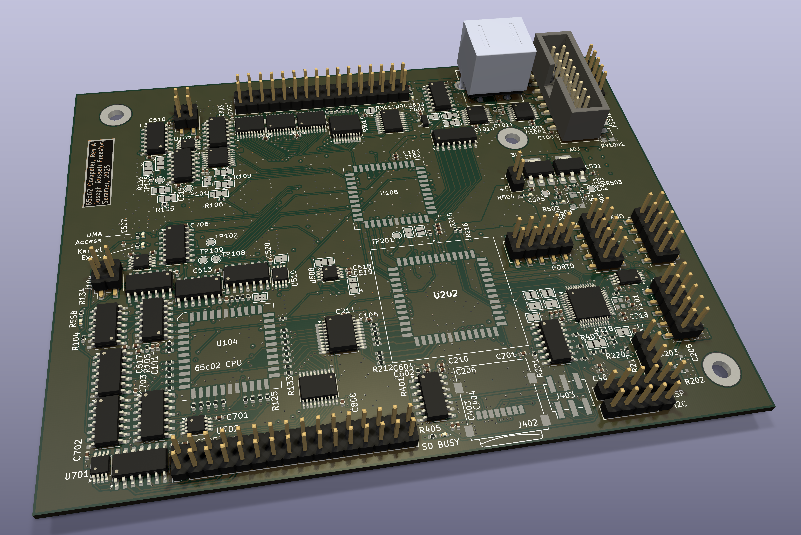
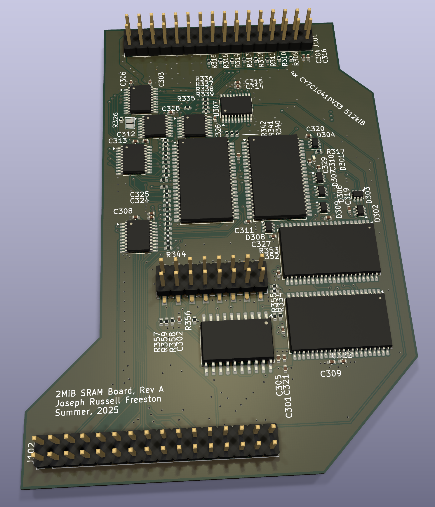

# Useful 6502 Machine

The goal of this project is to build a 6502-based portable machine,
running my own operating system.

## Current Status

*See the complete implementation plan and progress here: [Implemementation Plan](./IMPLEMENTATION_PLAN.md)*

PCB assembled, blinky light on PIC is working.

## Hardware Goals

*These are some general points; for the full hardware specification, see here: [Hardware Specification](./HARDWARE.md)*

I want the following end goals to categorize the machine as "useful":

- At least 2 Megabytes of program memory and 2 Megabytes of data memory, of which at least 16k of memory can be used by a single process.
- Protected memory (kernel and user run modes defined by hardware checking if kernel or user code is being executed)
- PIC16 as peripheral coprocessor for fast i/o

## Software Goals

- Traps via "BRK" instruction for sys calls
- Full preemptive multitasking with up to 255 processes, round robin scheduler (maybe mlfq eventually)
- Filesystem: Tree, leaf nodes are devices or drivers.
- Driver for FAT32-formatted SD cards for easy file storage & transfer
- Standard library compatible with cc65 for creating high-level programs
- Basic UNIX-like shell utilities
- Simple web browser?
- SSH client based on DropBear?

## Faults

Faults will be detected by hardware and trigger a RESET, and the kernel will terminate the process.

## Hardware Timers

A hardware timer using the 65c22 will be used to interrupt processes with an NMI.
The kernel will maintain a global clock for user timing needs.

The PIC peripheral coprocessor may, perhaps, feature a watchdog timer to restart the kernel in the event of a crash.

## Particularly Helpful References

There are many resources that have proven themselves indispensible to the progress of his project.  
Here is a *small subset* of such resources:

- <https://www.pagetable.com/c64ref/6502/#>
- <http://www.6502.org/users/andre/index.html>
- <https://wilsonminesco.com/>
- <https://www.burtonsys.com/ps2_chapweske.htm>
- <https://www.pagetable.com/?p=1416>
- <https://github.com/commanderx16/x16-rom/>
